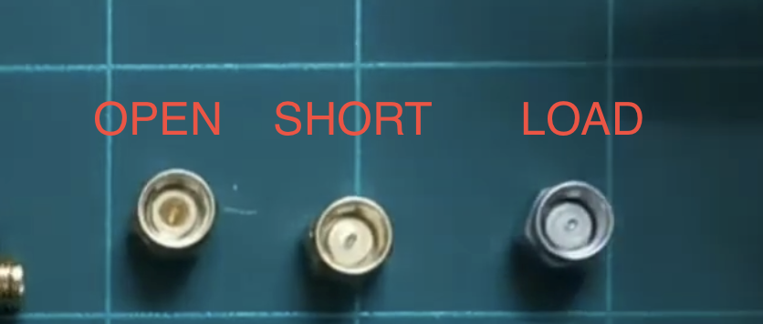

# NanoVNA-F V2
Portable Vector Network Analyzer

## For calibration

Lastly, `thru` is SMA to SMA -cable between PORT1 <-> PORT2

## References
* [Official Manual](https://www.sysjoint.com/ueditor/php/upload/file/PDF/NanoVNA-F%20V2%20Portable%20Vector%20Network%20Analyzer%20User%20Guide%20V2.0.pdf) 
* Alternative Manual: https://nanorfe.com/nanovna-v2-user-manual.html
* Good theory behind calibration and device: https://www.youtube.com/watch?v=_pjcEKQY_Tk

