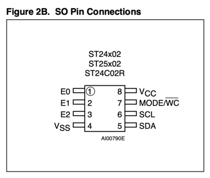

# Arduino UNO

## i2c-writer
* Based on this project https://create.arduino.cc/projecthub/gatoninja236/how-to-use-i2c-eeprom-30767d, this one is able to write and read ST24C02 (256x8) I2C EEPROM's:



* Just connect Arduino pins: `SDA pin GPIO18 -> chip pin5, SCL pin GPIO19 -> chip pin6` and supply voltage `3.3V -> chip pin8, GND -> chip pin4`
* When running, should output something like:
```
21:58:04.439 -> Write done
21:58:04.439 -> 19 bytes
21:58:04.936 -> D
21:58:04.936 -> E
21:58:04.936 -> A
21:58:04.936 -> D
21:58:04.936 -> B
21:58:04.936 -> E
21:58:04.936 -> E
21:58:04.936 -> F
21:58:04.936 ->  
21:58:04.936 -> R
21:58:04.976 -> U
21:58:04.976 -> L
21:58:04.976 -> E
21:58:04.976 -> S
21:58:04.976 ->  
21:58:04.976 -> 2
21:58:04.976 -> 0
21:58:04.976 -> 2
21:58:04.976 -> 2
21:58:04.976 -> Read done
```

## Configure Arduino UNO as SPI programmer
* Ref: https://tomvanveen.eu/flashing-bios-chip-arduino/

```
sudo apt install git flashrom gcc-avr binutils-avr avr-libc avrdude
git clone --recursive https://github.com/tomvanveen/frser-duino.git
cd frser-duino
make ftdi 
sudo make flash-ftdi
```

* If building above fails, modify the following (modify speed + /dev/)
```
--- a/Makefile
+++ b/Makefile
@@ -88,6 +88,9 @@ u2:
 
 flash-u2:
        BLBAUD=115200 SERIAL_DEV=/dev/ttyACM0 $(MAKE) program
+       
+flash-ch341:
+       BLBAUD=115200 SERIAL_DEV=/dev/ttyUSB0 $(MAKE) program
```


## SPI (Winbond W25Q16JV)


* Prepare Arduino as SPI programmer (see above)
* Wiring:

 | winbond  | arduino  |
 |---|---|
 | 1  CS | 10   SS |
 | 2  DO | 12 MISO |
 | 3  WP | -- 3.3V |
 | 4 GND | --  GND |
 | 5  DI | 11 MOSI |
 | 6 CLK | 13  SCK |
 | 7 RST | -- 3.3V |
 | 8 VCC | -- 3.3V |

* Flashrom
 
```
# test
./flashrom -p serprog:dev=/dev/ttyACM0:115200

# outputs:
./flashrom -p serprog:dev=/dev/ttyACM0:115200 -c W25Q16.V                                                                    ✔  at 15:15:11  
flashrom v1.2-1248-g3ed016f0 on Linux 5.19.0-38-generic (x86_64)
flashrom is free software, get the source code at https://flashrom.org

Using clock_gettime for delay loops (clk_id: 1, resolution: 1ns).
serprog: Programmer name is "frser-duino"
Found Winbond flash chip "W25Q16.V" (2048 kB, SPI) on serprog.
...
...

# read
./flashrom -p serprog:dev=/dev/ttyACM0:115200 -c W25Q16.V --progress -r blob.bin


# write
./flashrom -p serprog:dev=/dev/ttyACM0:115200 -c W25Q16.V --progress -w ~/temp/blob.bin

# outputs:
flashrom v1.2-1248-g3ed016f0 on Linux 5.19.0-38-generic (x86_64)
flashrom is free software, get the source code at https://flashrom.org

Using clock_gettime for delay loops (clk_id: 1, resolution: 1ns).
serprog: Programmer name is "frser-duino"
Found Winbond flash chip "W25Q16.V" (2048 kB, SPI) on serprog.
===
This flash part has status UNTESTED for operations: WP
The test status of this chip may have been updated in the latest development
version of flashrom. If you are running the latest development version,
please email a report to flashrom@flashrom.org if any of the above operations
work correctly for you with this flash chip. Please include the flashrom log
file for all operations you tested (see the man page for details), and mention
which mainboard or programmer you tested in the subject line.
Thanks for your help!
Reading old flash chip contents... [READ] 1% complete... [READ] 2% complete... <SNIP><SNIP> [READ] 99% complete... [READ] 100% complete... done.
Erasing and writing flash chip... [WRITE] 100% complete... Erase/write done.
Verifying flash... [READ] 1% complete... [READ] 2% complete... <SNIP> <SNIP> [READ] 99% complete... [READ] 100% complete... VERIFIED.


```


