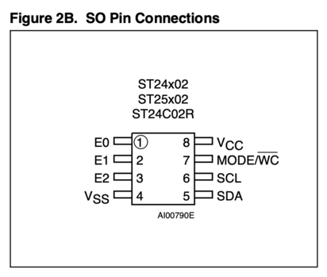

# Arduino UNO

## i2c-writer
* Based on this project https://create.arduino.cc/projecthub/gatoninja236/how-to-use-i2c-eeprom-30767d, this one is able to write and read ST24C02 (256x8) I2C EEPROM's:



* Just connect Arduino pins: `SDA -> chip pin5, SCL -> chip pin6` and supply voltage `3.3V -> chip pin8, GND -> chip pin4`
* When running, should output something like:
```
21:58:04.439 -> Write done
21:58:04.439 -> 19 bytes
21:58:04.936 -> D
21:58:04.936 -> E
21:58:04.936 -> A
21:58:04.936 -> D
21:58:04.936 -> B
21:58:04.936 -> E
21:58:04.936 -> E
21:58:04.936 -> F
21:58:04.936 ->  
21:58:04.936 -> R
21:58:04.976 -> U
21:58:04.976 -> L
21:58:04.976 -> E
21:58:04.976 -> S
21:58:04.976 ->  
21:58:04.976 -> 2
21:58:04.976 -> 0
21:58:04.976 -> 2
21:58:04.976 -> 2
21:58:04.976 -> Read done
```
