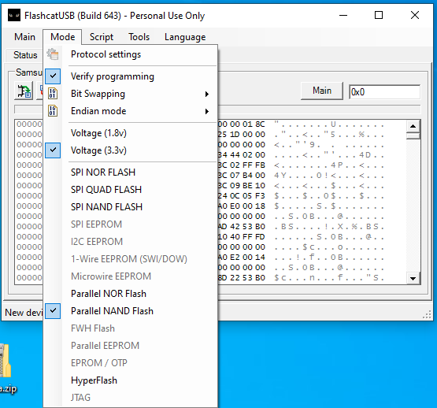
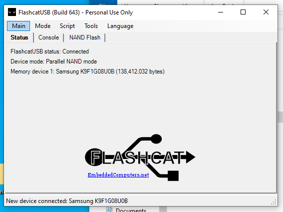
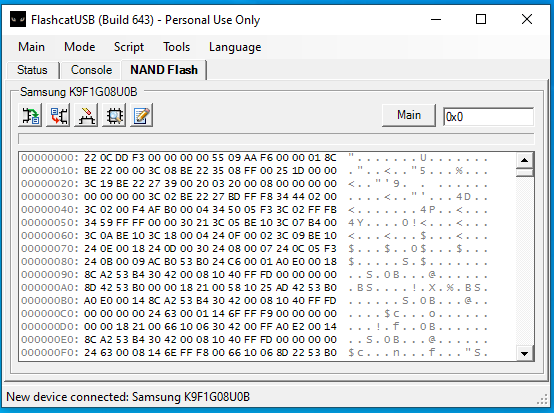
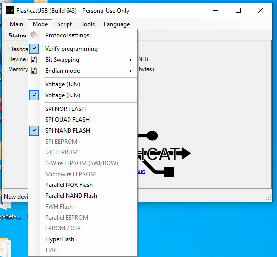
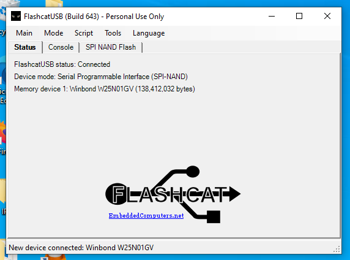
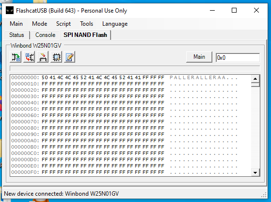

# FlashcatUSB Mach (PCB 2.2)

* Manual: https://darkwire.app/Downloads/FlashcatUSB_Manual.pdf

## Adapter mode

### TSOP-48 (NAND) example, Samsung

## SPI mode

### Wirings
* [pic1](images/flashcatusb-SPI.jpg) (Snatched from: https://www.blackcatusb.net/index.php?threads/spi-pins-be-on-mach1.674/)
* [pic2](images/flashcatusb-SPI-wires.jpg) (Snatched from: https://imgur.com/a/I9Bmd3d#R3mzm6t)

### SPI example, Winbond

