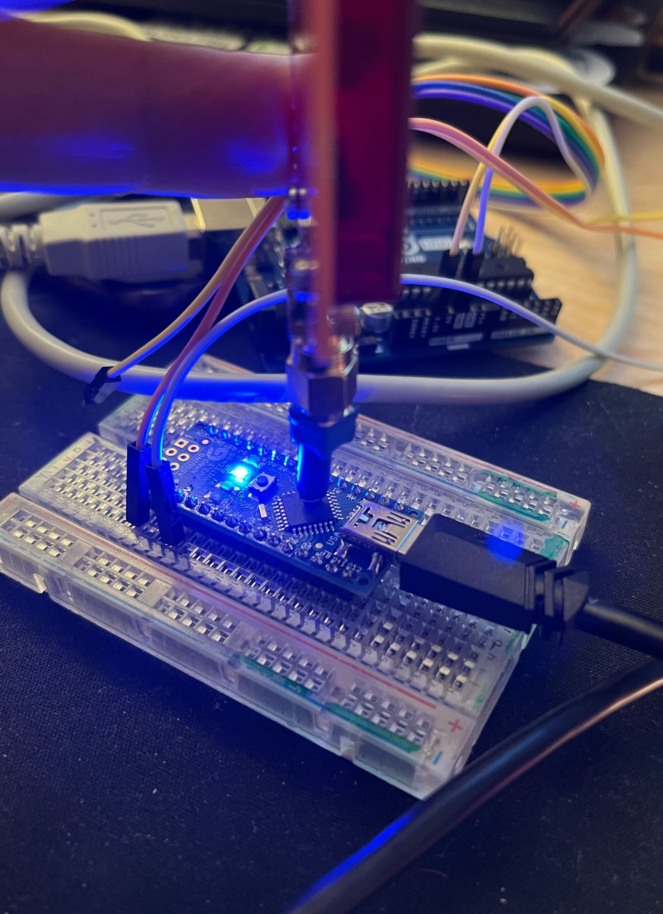

# Arduino NANO (or UNO) Glitching

Here we'll glitch (do an Electromagnetic Fault Injection, EMFI) against Arduino boards as they did in [Riscure Hardware CTF 2016, Fiesta](https://pedro-javierf.github.io/devblog/rhmefaultinjection/).
Please see all theory from this excelent [NewAE Tech site](https://github.com/newaetech/chipshouter-picoemp).

## preparations
Requirements:
* 1x Arduino Nano or 1x Arduino UNO, we'll be focusing in Arduino Nano here
* 1x UART capable board (BusPirate, HydraBus, USB-UART converter
* breadboard + some jumper cables to make life easier (optional)

Installation steps:
1. Assemble PicoEMP device as instructed in [NewAE Tech site](https://github.com/newaetech/chipshouter-picoemp) and flash it using stock firmware
1. Setup Arduino IDE, [read here](https://www.arduino.cc/en/software)
1. Flash [glitch-loop-working.ino](glitch-loop-working.ino) application into Arduino Nano
1. Hook Arduino Nano UART TX into PC's UART RX
1. Open UART in screen, e.g. `screen /dev/ttyUSBx 9600`
1. Start glitching as shown in this picture, according some personal research, the "hotspot's" are shown in pictures:
 
 

1. Once successful, one should see something like:
```
...
Loop 1, counter=9
Loop 1, counter=10
Loop 1, counter=11
Loop 1, counter=12
Loop 1, counter=13
Loop 1, counter=14
Loop 1, counter=15
Loop 1, counter=16
...
...
Loop 1, counter=113
Loop 2, counter=0
Loop 2, counter=1
...
...
Glitched! Flag {123123123}, counter=0
Glitched! Flag {123123123}, counter=1
Glitched! Flag {123123123}, counter=2
Glitched! Flag {123123123}, counter=3
Glitched! Flag {123123123}, counter=4
```
1. _Please do notice_: It does take **many tries** and getting it executed using exact timing is THE tricky part! :)
