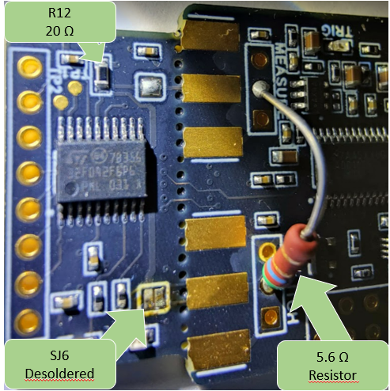
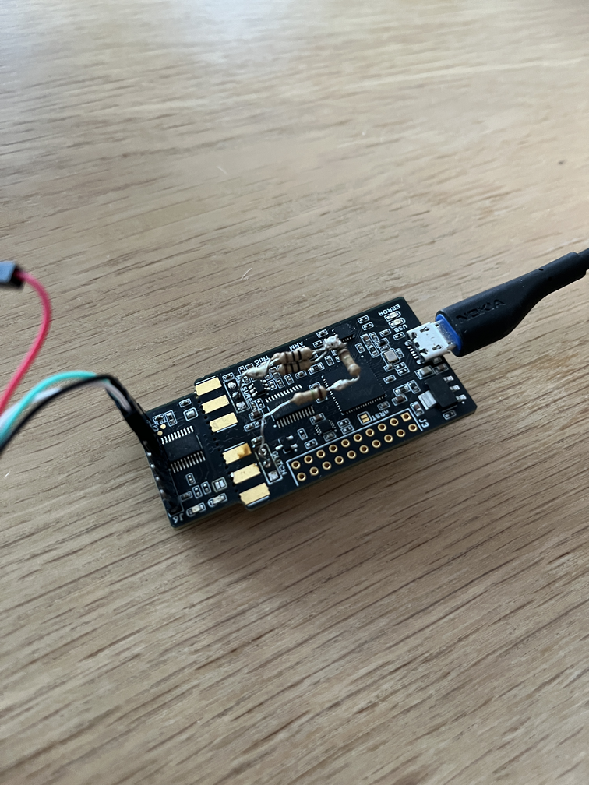

# Setup chipwhisperer
Setup battletested with Debian12, ackward reboots ahead.


## Chipwhisperer NANO FYI!
I've tried to glitch for 3-4 days without this modification and failed miserably. Could not get any glitches using vanilla CWNANO board. Therefore I'm pretty convinced that if you have CWNANO and your R12 has 20ohm resistor -> this modification is more or less _mandatory_:

 

All information can be found from this repo: https://github.com/rlangoy/cwr_nano_vdd_glitching

Cheers to __Rune Langøy__ for this awesome info!!!

**NOTE**: Personally I did not have any 5.6ohm resistors available so had to improvise using parallel and serial circuit to achive my goal. My "setup" has 5.3-5.5ohm which seems to be okay'ish :)
 
 

## env
```
sudo apt update && sudo apt upgrade

# python prereqs
sudo apt-get install build-essential gdb lcov pkg-config \
    libbz2-dev libffi-dev libgdbm-dev libgdbm-compat-dev liblzma-dev \
    libncurses5-dev libreadline6-dev libsqlite3-dev libssl-dev \
    lzma lzma-dev tk-dev uuid-dev zlib1g-dev curl

sudo apt install libusb-dev make git avr-libc gcc-avr \
    gcc-arm-none-eabi libusb-1.0-0-dev usbutils

python3 -m venv ~/pythons/chipwhisperer
source ~/pythons/chipwhisperer/bin/activate

cd ~/git
git clone https://github.com/newaetech/chipwhisperer
cd chipwhisperer
sudo cp hardware/50-newae.rules /etc/udev/rules.d/50-newae.rules
sudo udevadm control --reload-rules
sudo groupadd -f chipwhisperer
sudo usermod -aG chipwhisperer $USER
sudo usermod -aG plugdev $USER

####################################
# reboot - yes really
####################################

source ~/pythons/chipwhisperer/bin/activate
cd ~/git/chipwhisperer
git submodule update --init jupyter

pip install -e .
pip install -r jupyter/requirements.txt
cd jupyter
pip install nbstripout
nbstripout --install

# fix jupyter \o/
pip uninstall traitlets
pip install traitlets==5.9.0
```

## run jupyter notebooks
```
jupyter notebook
```

If you encounter jupyter errors like:
```
...
[I 23:41:34.568 NotebookApp] [jupyter_nbextensions_configurator] enabled 0.6.3
[W 23:41:35.043 NotebookApp] Error loading server extension panel.io.jupyter_server_extension
    Traceback (most recent call last):
...
```

then just (will handle deps too):
```
pip uninstall panel
pip install panel
```

## build firmwares
Linux:
```
cd $GITROOT/hardware/victims/firmware/simpleserial-glitch/
#make PLATFORM=CWNANO CRYPTO_TARGET=NONE S_VER=SS_VER_1_1 # SimpleSerial, should not be using this!
make PLATFORM=CWNANO CRYPTO_TARGET=NONE S_VER=SS_VER_2_1 # SimpleSerial2
```

M1 (ARM) Macbook:
```
cd $GITROOT/hardware/victims/firmware/simpleserial-glitch/
brew install make
/opt/homebrew/Cellar/make/4.4.1/libexec/gnubin/make PLATFORM=CWNANO CRYPTO_TARGET=NONE SS_VER='SS_VER_2_1' # at the time of writing, version was: 'GNU Make 4.4.1' 
```

## Observations from glitching
When running `python voltage_glitch-password-cwnano1-exact.py` I observed at least following values to be working (using the 20ohm modification), outputs:

```
repeat = 5, ext_offset = 5

...

repeat = 5, ext_offset = 9

...

repeat = 6, ext_offset = 2

...
(at this point I added more output)
...


1
reset
reset
reset
101
success at 156
{'valid': True, 'payload': CWbytearray(b'01'), 'full_response': CWbytearray(b'00 72 01 01 d4 00'), 'rv': bytearray(b'\x00')}
CWbytearray(b'01')
5 9

...

1
reset
reset
reset
reset
101
success at 124
{'valid': True, 'payload': CWbytearray(b'01'), 'full_response': CWbytearray(b'00 72 01 01 d4 00'), 'rv': bytearray(b'\x00')}
CWbytearray(b'01')
5 9

...


1
reset
101
reset
201
301
reset
401
reset
501
success at 526
{'valid': True, 'payload': CWbytearray(b'01'), 'full_response': CWbytearray(b'00 72 01 01 d4 00'), 'rv': bytearray(b'\x00')}
CWbytearray(b'01')
5 9

...


1
success at 74
{'valid': True, 'payload': CWbytearray(b'01'), 'full_response': CWbytearray(b'00 72 01 01 d4 00'), 'rv': bytearray(b'\x00')}
CWbytearray(b'01')
5 9

...


1
101
201
301
success at 345
{'valid': True, 'payload': CWbytearray(b'01'), 'full_response': CWbytearray(b'00 72 01 01 d4 00'), 'rv': bytearray(b'\x00')}
CWbytearray(b'01')
5 9

...


1
101
success at 124
{'valid': True, 'payload': CWbytearray(b'01'), 'full_response': CWbytearray(b'00 72 01 01 d4 00'), 'rv': bytearray(b'\x00')}
CWbytearray(b'01')
5 9

...

1
101
reset
success at 167
{'valid': True, 'payload': CWbytearray(b'01'), 'full_response': CWbytearray(b'00 72 01 01 d4 00'), 'rv': bytearray(b'\x00')}
CWbytearray(b'01')
5 9

...

1
101
success at 115
{'valid': True, 'payload': CWbytearray(b'01'), 'full_response': CWbytearray(b'00 72 01 01 d4 00'), 'rv': bytearray(b'\x00')}
CWbytearray(b'01')
5 9

...
```
