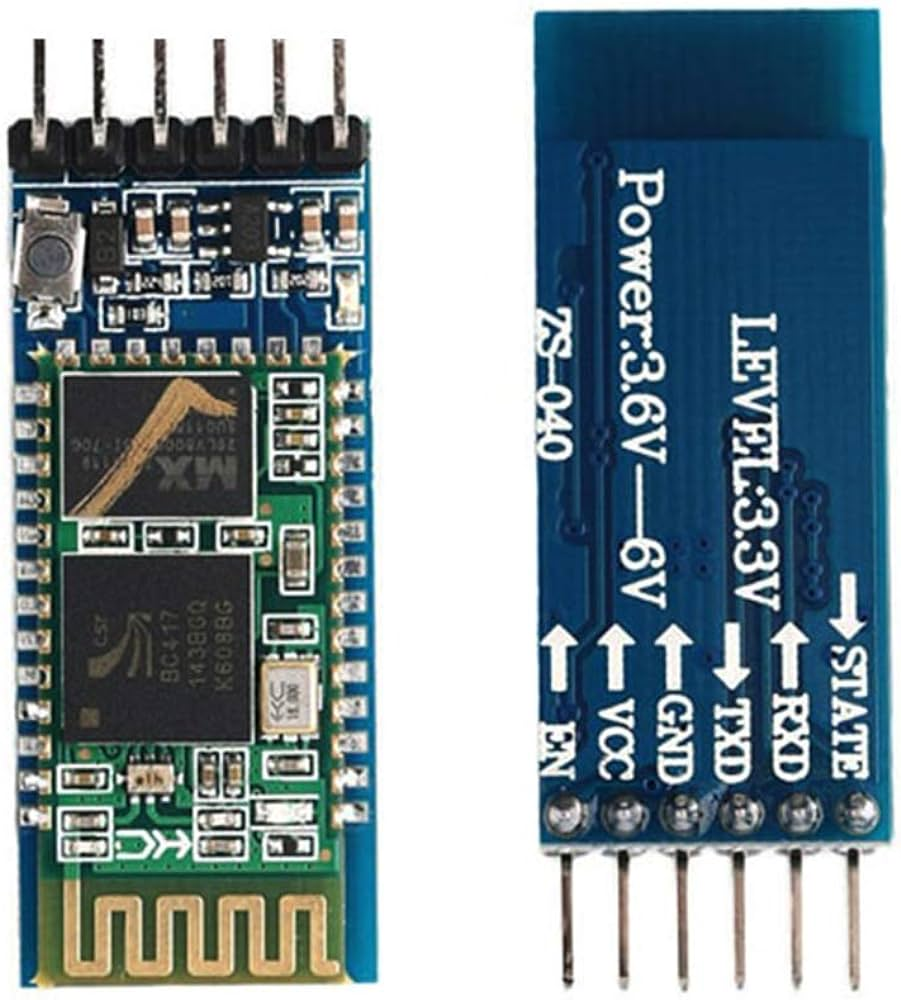

# HC05

## Super cheap wireless UART board
Testing of HC05 board, super cheap wireless serial port board



## Documentation :)

Insert USB-dongle and power up HC05 board. To pair (only once) and use:
```
bluetoothctl
scan on

# when found...
scan off

# use found MAC ADDRESS
pair <MAC ADDRESS>
# enter PIN 1234
```

Next setup UART for HC05:
```
rfcomm bind 0 <MAC ADDRESS>

# should be visible in:
ls -ltr /dev/rfcommN (N=0 usually)

# connect
picocom -b 9600 /dev/rfcommN
```
