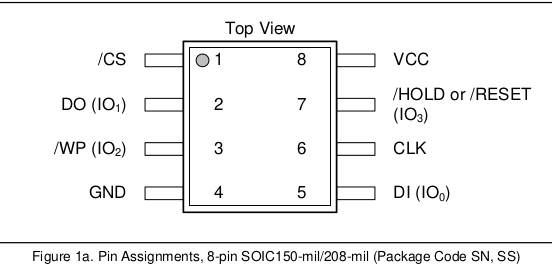

# RaspberryPI model 4B
Using RPi is way faster than for example Arduino. Original story: https://libreboot.org/docs/install/spi.html

## SPI (Winbond W25Q16JV)



* Wiring:

 | winbond  | RaspberryPi 4B |
 |---|---|
 | 1  CS | 24/CEO   SS |
 | 2  DO | 12/MISO MISO |
 | 3  WP | NC |
 | 4 GND | GND |
 | 5  DI | 21/MOSI MOSI |
 | 6 CLK | 13/SCLK  SCLK |
 | 7 RST | 3.3V |
 | 8 VCC | 3.3V |

* Flashrom
 
```
# test
./flashrom -p linux_spi:dev=/dev/spidev0.0,spispeed=32768

# read
./flashrom -p linux_spi:dev=/dev/spidev0.0,spispeed=32768 -r plaa.bin

# write
./flashrom -p linux_spi:dev=/dev/spidev0.0,spispeed=32768 -w plaa.bin
```


