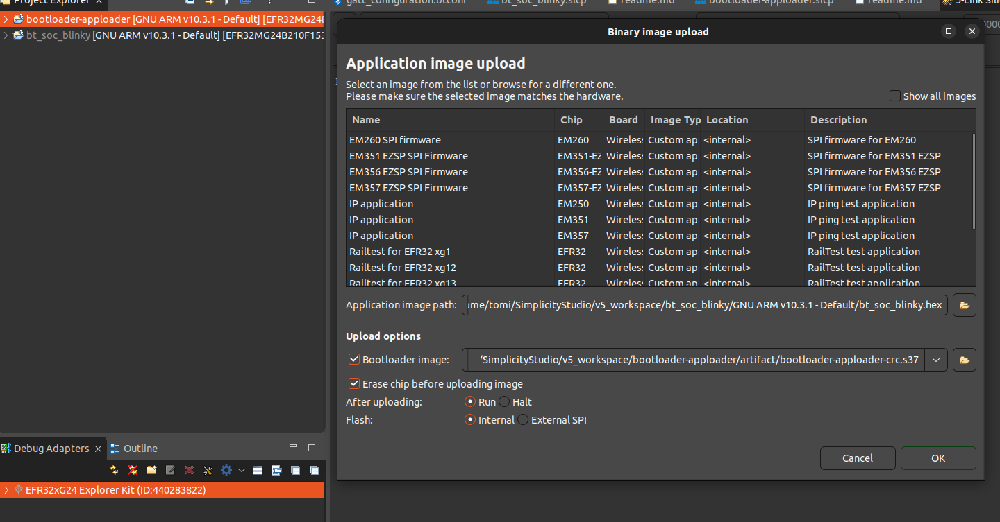

# EFR32xG24 Explorer Kit 

## Quick start (Ubuntu)

1. Download and extract SimplicityStudio
1. Open using `studiowayland.sh` - VERY IMPORTANT STEP, otherwise installation gets borked (due missing packages, SDK-parts etc.)
1. Create some sample program using _Welcome_
1. See that it compiles and it flashes
1. If above steps still does get errors, remove all SimplicityStudio files including workspaces and retry (fastest approach)

## Flashing
1. Create separate projects for Bootloader and some example app like Blinky
1. Build both solutions
1. Use `Debug Adapters` and right-click (disconnected) board with `Upload applcation...`
1. Tick `Erase chip before uploading image`, set `Application image path` and `Bootloader image` as shown in picture and press `OK`:
 
  
