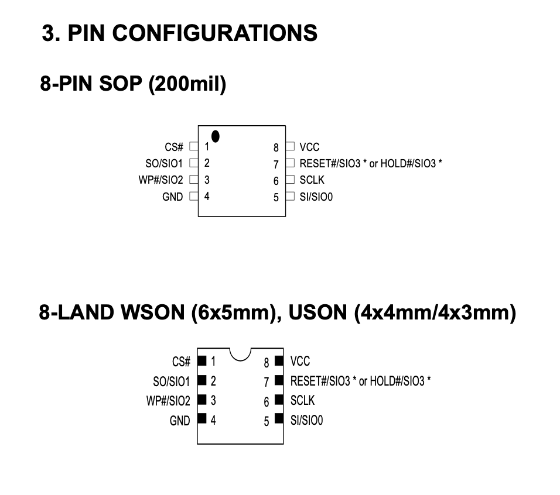

# Tigard
Using SPI with Tigard is fastest solution for SPI dumping: https://github.com/tigard-tools/tigard

## SPI (Macronix MX25R6435F)

* Set Tigard voltage to 3.3v
* Set Tigard mode switch to JTAG/SPI



* Wiring:

 | macronix  | tigard |
 |---|---|
 | 1  CS | SPI CS |
 | 2  SO/SIO1 | SPI CIPO |
 | 3  WP#SIO2 | NC |
 | 4 GND | SPI GND |
 | 5  SI/SIO0 | SPI COPI |
 | 6 SCLK | SPI SCK |
 | 7 RESET/HOLD | NC  |
 | 8 VCC | SPI VGT |


* Flashrom
 
```
# test
./flashrom -p ft2232_spi:type=2232H,port=B,divisor=4

# read
./flashrom -p ft2232_spi:type=2232H,port=B,divisor=4 -r foo.bin --progress
```


