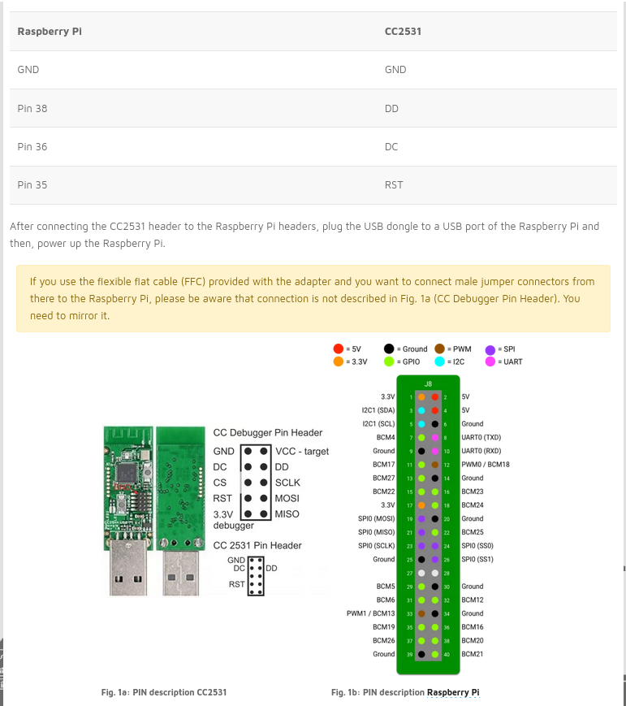

# Zigbee
Various Zigbee stuff

## CC2531 Dongle (sniffer)
* https://www.zigbee2mqtt.io/guide/adapters/flashing/alternative_flashing_methods.html
* https://lemariva.com/blog/2019/08/zigbee-flashing-cc2531-using-raspberry-pi-without-cc-debugger

### Process
* Raspberry PI 4
* Setup wiring
* Flash PACKET-SNIFFER (from TI)

### Wiring
* ref: https://lemariva.com/blog/2019/08/zigbee-flashing-cc2531-using-raspberry-pi-without-cc-debugger

